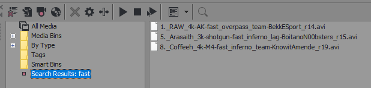

<div align="center" text-align="center">

# frag-finder

A CLI tool that consumes JSON files exported from [CS:GO Demos Manager](https://github.com/akiver/CSGO-Demos-Manager) and spits out readable highlights meant as helpful filenames for CS:GO fragmovie recording.

&nbsp;

<p>
  
  
</p>
<p>
  <a href="#how-to-use">How to use</a> &#xa0; | &#xa0;
  <a href="#requirements">Requirements</a> &#xa0; | &#xa0;
  <a href="#options">Options</a> &#xa0; | &#xa0;
  <a href="#example">Example</a> &#xa0;
</p>

</div>

## Example output and explanation

```
**playdemo astralis-vs-complexity-m3-nuke@128052

   x._junior_ACE-AWP(3)-pistol(1)-spread_nuke_team-Complexity_r09 1:22 (demo_gototick 128652)
   x._floppy_4k-M4-fast_nuke_team-Complexity_r15 1:06 (demo_gototick 250415)
   x._blameF_4k-M4_nuke_team-Astralis_r22_#ANTIECO 1:44 (demo_gototick 337706)

         ----3k's:
               x._gla1ve_3k-MAC-10-fast_nuke_team-Astralis_r03 1:38 (demo_gototick 33789)
               x._gla1ve_3k-AK(1)-AWP(2)_nuke_team-Astralis_r09 0:36 (demo_gototick 134588)


**playdemo faze-vs-og-m1-ancient@117776

   x._Twistzz_1v3-AK_ancient_team-FaZe_r09_#ANTIECO 1:13 (demo_gototick 118376)
   x._flameZ_4k-MP9(1)-AK(2)-HE(1)_ancient_team-OG_r18 1:45 (demo_gototick 214930)

         ----3k's:
               x._NEOFRAG_3k-AK_ancient_team-OG_r02 1:42 (demo_gototick 12142)
               x._ropz_3k-M4-spread_ancient_team-FaZe_r04 1:36 (demo_gototick 38801)
```

- `spread` (as in the frags being "spread out") is labelled for any 3k, 4k or ace where at least 15 seconds elapsed between two or more of the eliminations.
- `fast` is labelled for any highlight where all the kills happen within six seconds.
- The timestamp listed at the end of each highlight represents the time shown on the ingame clock when the first frag of the highlight occurs.
- The tick listed at the end of each highlight is the tick right before the first opponent elimination of the highlight occurs. Including `demo_gototick` is meant for easier copy/paste to the in-game console.
  - The tick after the demo name, for example <i>playdemo astralis-vs-complexity-m3-nuke</i>`@128052` makes it so that you're taken to the start of the first highlight when the demo loads (the tick buffer here is larger than the tick at the end of the highlight text since the demo seems to play in the background for some time when loading, making it so the first few frags might have already happened when you start watching).
- The round number is shown at the end of each highlight, for example `r25` for round 25.
- the `x._` preceding every highlight is meant to be replaced by a number when you have recorded the highlight, making the whole line appropriate as a filename for your video file. The information provided in the filename will then be easily searchable in your editing software, serving as helpful tags. For example:

  

## How to use

### Alternative 1 (recommended)

Prerequisites: [CS:GO Demos Manager](https://github.com/akiver/CSGO-Demos-Manager)

1. Open the demos in [CS:GO Demos Manager](https://github.com/akiver/CSGO-Demos-Manager), select all and and click "analyze". With all demos still selected, right click and click "Export JSON".
2. Upload the files to the web GUI at [fragfinder.app](https://fragfinder.app/)

📺 [_Watch tutorial_](https://www.youtube.com/watch?v=g7UYciS2Hbg)

### Alternative 2

Prerequisites: [Node](https://nodejs.org/en/) and [CS:GO Demos Manager](https://github.com/akiver/CSGO-Demos-Manager)

1. Download or clone this repo.
2. Run `npm install` in the root folder.
3. Open the demos in [CS:GO Demos Manager](https://github.com/akiver/CSGO-Demos-Manager), select all and and click "analyze". With all demos still selected, right click and click "Export JSON". Move the exported files to the [json](json) folder.
4. Run `npm run build` and `npm start`. The text file containing the highlights for all demos will be created in the [exports](exports) folder.

<i>If you want to run the script again with different JSON files, move the already exported text file to a different location to prevent it from being overwritten.</i>

## Options

- If you want to get frags of a single player only, add their STEAMID64 to `getFrags` in [src/app.ts](src/app.ts):

  ```javascript
  getFrags({
    playerSteamId: "76561198036024464",
  });
  ```

## Example

You can see an example of exported highlights in the [exports](exports/example.txt) folder.
